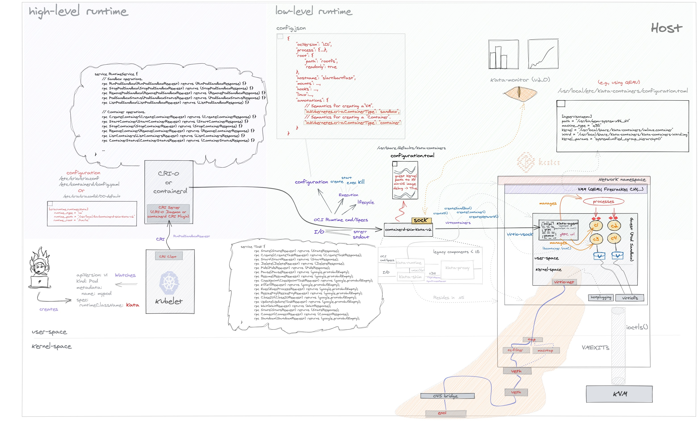

# kata container 中的调用流程
> cri 的实现此处选的是  containerd, 选 crio 的话流程基本类似的

`kubelet ---(1)--> containerd ----(2)---> containerd-kata-shim-v2 ------> kata-agent`
> 其中 (1) 为 gRpc 方式，API 为 CRI
> (2) 为 ttrpc 方式，API 为 containerd 的 runtime v2, 传递的数据W为  oci spec

总体流程可以参考 



## CRI 接口

[kubernetes/cri-api](https://github.com/kubernetes/cri-api/blob/master/pkg/apis/runtime/v1/api.proto)

```bash
// Runtime service defines the public APIs for remote container runtimes
service RuntimeService {
    rpc Version(VersionRequest) returns (VersionResponse) {}
	
	// sandbox
    rpc RunPodSandbox(RunPodSandboxRequest) returns (RunPodSandboxResponse) {}
    rpc StopPodSandbox(StopPodSandboxRequest) returns (StopPodSandboxResponse) {}
    rpc RemovePodSandbox(RemovePodSandboxRequest) returns (RemovePodSandboxResponse) {}
    rpc PodSandboxStatus(PodSandboxStatusRequest) returns (PodSandboxStatusResponse) {}
    rpc ListPodSandbox(ListPodSandboxRequest) returns (ListPodSandboxResponse) {}
	
	// container
    rpc CreateContainer(CreateContainerRequest) returns (CreateContainerResponse) {}
    rpc StartContainer(StartContainerRequest) returns (StartContainerResponse) {}
    rpc StopContainer(StopContainerRequest) returns (StopContainerResponse) {}
    rpc RemoveContainer(RemoveContainerRequest) returns (RemoveContainerResponse) {}
    rpc ListContainers(ListContainersRequest) returns (ListContainersResponse) {}
    rpc ContainerStatus(ContainerStatusRequest) returns (ContainerStatusResponse) {}
    rpc UpdateContainerResources(UpdateContainerResourcesRequest) returns (UpdateContainerResourcesResponse) {}

    rpc ExecSync(ExecSyncRequest) returns (ExecSyncResponse) {}
    rpc Exec(ExecRequest) returns (ExecResponse) {}
    rpc Attach(AttachRequest) returns (AttachResponse) {}
    rpc PortForward(PortForwardRequest) returns (PortForwardResponse) {}
    rpc ContainerStats(ContainerStatsRequest) returns (ContainerStatsResponse) {}
    rpc ListContainerStats(ListContainerStatsRequest) returns (ListContainerStatsResponse) {}
    rpc UpdateRuntimeConfig(UpdateRuntimeConfigRequest) returns (UpdateRuntimeConfigResponse) {}
    rpc Status(StatusRequest) returns (StatusResponse) {}
}

// ImageService defines the public APIs for managing images.
service ImageService {
    rpc ListImages(ListImagesRequest) returns (ListImagesResponse) {}
    rpc ImageStatus(ImageStatusRequest) returns (ImageStatusResponse) {}
    rpc PullImage(PullImageRequest) returns (PullImageResponse) {}
    rpc RemoveImage(RemoveImageRequest) returns (RemoveImageResponse) {}
    rpc ImageFsInfo(ImageFsInfoRequest) returns (ImageFsInfoResponse) {}
}
```


## containerd runtime v2 接口
[containerd/containerd runtime v2 task API](https://github.com/containerd/containerd/blob/main/runtime/v2/task/shim.proto)

```bash
service Task {
	rpc State(StateRequest) returns (StateResponse);
	rpc Create(CreateTaskRequest) returns (CreateTaskResponse);
	rpc Start(StartRequest) returns (StartResponse);
	rpc Delete(DeleteRequest) returns (DeleteResponse);
	rpc Pids(PidsRequest) returns (PidsResponse);
	rpc Pause(PauseRequest) returns (google.protobuf.Empty);
	rpc Resume(ResumeRequest) returns (google.protobuf.Empty);
	rpc Checkpoint(CheckpointTaskRequest) returns (google.protobuf.Empty);
	rpc Kill(KillRequest) returns (google.protobuf.Empty);
	rpc Exec(ExecProcessRequest) returns (google.protobuf.Empty);
	rpc ResizePty(ResizePtyRequest) returns (google.protobuf.Empty);
	rpc CloseIO(CloseIORequest) returns (google.protobuf.Empty);
	rpc Update(UpdateTaskRequest) returns (google.protobuf.Empty);
	rpc Wait(WaitRequest) returns (WaitResponse);
	rpc Stats(StatsRequest) returns (StatsResponse);
	rpc Connect(ConnectRequest) returns (ConnectResponse);
	rpc Shutdown(ShutdownRequest) returns (google.protobuf.Empty);
}
```


## OCI bundle

OCI runtimeSpec 定义的数据在 `/var/run/containerd/io.containerd.runtime.v2.task/k8s.io/<task ID>/config.json`

bundle path 中的文件，分两种：sandbox 和 container

- sandbox

```bash
ls -al /var/run/containerd/io.containerd.runtime.v2.task/k8s.io/<task ID>/
-rw-r--r--  1 root root   89 Oct  8 15:19 address
-rw-r--r--  1 root root 4674 Oct  8 15:19 config.json
prwx------  1 root root    0 Oct  8 15:19 log
drwxr-xr-x  1 root root 4096 Oct  8 15:19 rootfs
lrwxrwxrwx  1 root root  121 Oct  8 15:19 work -> /var/lib/containerd/io.containerd.runtime.v2.task/k8s.io/08ea62447079a5b95d6493d82a5d0253fda5b03130abab74d400e45bba725511
```

- containerd

```bash
ls -al /var/run/containerd/io.containerd.runtime.v2.task/k8s.io/<task ID>/
-rw-r--r--  1 root root   89 Oct  8 15:19 address
-rw-r--r--  1 root root 8373 Oct  8 15:19 config.json
prwx------  1 root root    0 Oct  8 15:19 log
-rw-r--r--  1 root root  101 Oct  8 15:19 monitor_address
drwxr-xr-x  1 root root 4096 Oct  8 15:19 rootfs
-rw-r--r--  1 root root    6 Oct  8 15:19 shim.pid
lrwxrwxrwx  1 root root  121 Oct  8 15:19 work -> /var/lib/containerd/io.containerd.runtime.v2.task/k8s.io/42c9241c910025e35858d44af039b94f58732f77876f2c1ef99c7a3a65bfd33c
```

具体参见 [config.json](data/config(oci%20spec).json)

## containerd-shim-kata-v2 流程

1. Create 
   1. load oci spec (从 config.json 的路径)
   2. 根据 container type
      1. sandbox
         1. load  runtime config (`configuration.toml`)
         2. 根据 oci spec `config.json` 和 kata 的 config `configuration.toml` 实例化 `VCSandbox`

      2. containerd
      
+.--
## virtcontainers


[virtcontainers API](https://github.com/kata-containers/kata-containers/blob/main/src/runtime/virtcontainers/documentation/api/1.0/api.md)