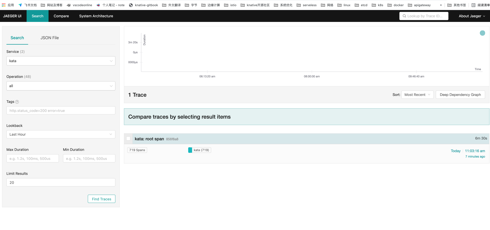
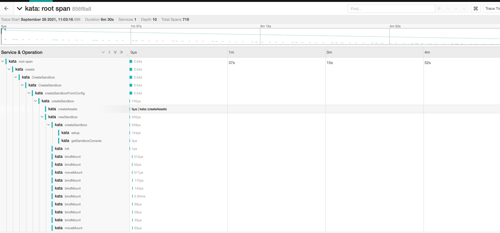

# kata 启动 trace

## kata runtime 配置中开启 trace

```bash
# vi /opt/kata/share/defaults/kata-containers/configuration.toml
[runtime]
enable_trace = true

# 默认的 jaeger 的endpoint 为  http://localhost:14268/api/traces
```

## 安装 jaeger

安装  jaeger，参考[官网](https://www.jaegertracing.io/docs/1.26/getting-started/)的  all-in-one, 配置的 pod 如下
```yaml
apiVersion: v1
kind: Pod
metadata:
  name: jaeger
spec:
  hostNetwork: true
  containers:
  - name: hello
    image: jaegertracing/all-in-one:1.26
    env:
    - name: COLLECTOR_ZIPKIN_HOST_PORT
      value: "9411"
```


pod running 之后，访问 UI，地址为  http://<HostIP>:16686

如图



等一会 containerd-shim-kata-v2 上报数据后，在界面点开 Service kata，
右下部分点开 kata root span，就可以看到  kata 的 trace 详情了

